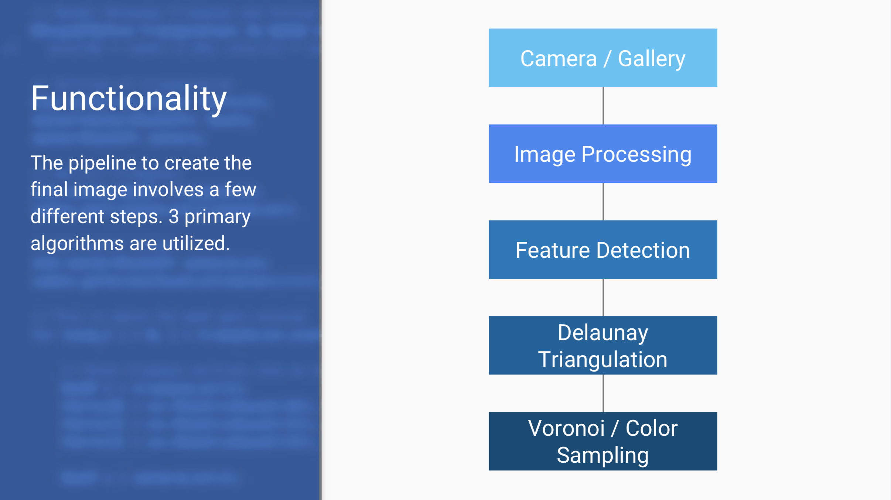
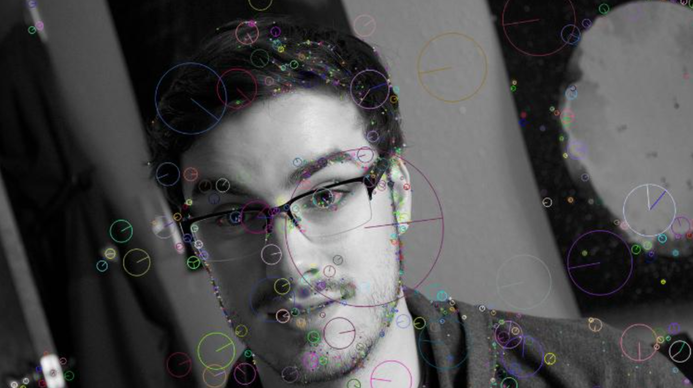
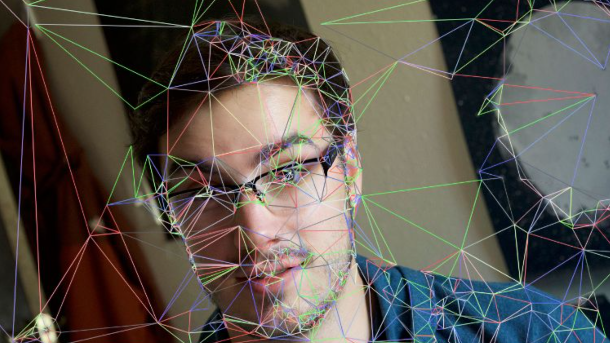

# LoPoly

## CSCI 4830: Computer Vision Final Project (Prayash Thapa and Martin Fejka)

## Initial Idea

Our idea was to create an iOS application that would generate artistic images out of pictures taken by the user. These pictures could be taken in real-time or uploaded via Camera Roll. We decided to develop an application that would procedurally generate an image composed of polygons as it is a common aesthetic used in modern design. In addition, it would provide additional parameters to users, all presented in a friendly UI.

## Approach

In order to use feature-detection, we had to use the experimental module provided by OpenCV which contains a collection of state-of-the-art algorithms. We were able to leverage the library fairly quickly and got the SIFT algorithm working, but that was only the beginning. In order to generate polygons, we had to triangulate between all the found features in an image. We integrated the Delaunay Triangulation algorithm, which involves creating a subdivision out of all the feature points and triangulating between them. After the triangulation, we had to fill all the polygons with the original colors sampled from the image. To make this happen, we used a Voronoi diagram algorithm that would provide us with all the facets of the polygons, but more importantly, it would allow us to easily find the centers of all the facets in the image. This made color sampling much simpler and after that we simply had to fill the polygons with the colors sampled from their respective centers.

## Results

The methods used in this application were:

- Basic image processing
- SIFT for feature detection
- Delaunay Triangulation for polygon generation
- Voronoi Diagrams for color sampling and facet coloration

## Limitations and future extensions

Ideally, we would love to improve the framerate of the app. With video input and all the processing that goes into the feature detection and triangulation, the framerate of the application drops to ~3 FPS. This is not good since we want the feedback to be relatively quick for any user to see the filter at work. We would also like to integrate OpenGL into the project in order to generate more advanced graphics as OpenCV doesn’t provide much flexibility with its drawing functions. Having the ability to add gradients, generate 3D models, and more captivating graphics is something we would like explore, but is beyond the scope of the class and time allotted. We would like to ship the app to the App Store once we feel that it is ready to offer something unique (which we think it will once we reach the aforementioned goals).

## Lessons Learned

We learned many lessons during this project:

- Integrating Computer Vision into an application requires a lot of planning and
  research. We spent countless hours simply getting OpenCV integration inside of
  iOS working smoothly.
- The implementation of CV into an application makes it feel ‘real’ vs. simply
  running a MATLAB script downloaded off the Web.
- Applying CV and getting good results involves a lot of ‘number massaging’,
  where we are simply varying numbers little by little to optimize results.

## Advice for future students

A few things that we would advise to future vision students are:

- Always try to integrate OpenCV into something else, whether that be desktop
  apps or mobile apps.. etc. The integration opens worlds of new possibilities and makes a project very exciting. Simply staying inside the MATLAB environment is not practical. Make a real app that you can feel in your hands or interact with in a very real way.
- Be able to dissect and reverse-engineer code. In order to develop our application, we had to dig through legacy sample code to understand what was going on.
- Error messages are your best friend, because that’s when you learn the most about any given system. Try your best to understand every debugging problem.

## Setup

Some notes on OpenCV: To run LoPoly on your machine you will need some libraries from OpenCV 3.1+ in addition to OpenCV3. Move OpenCV library to your project and ensure that you have referenced the path to wherever you placed the library in your framework search paths (in build settings).
